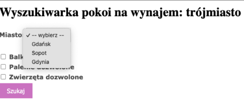
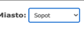
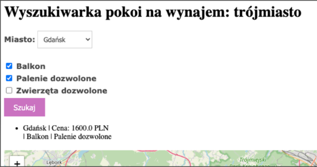
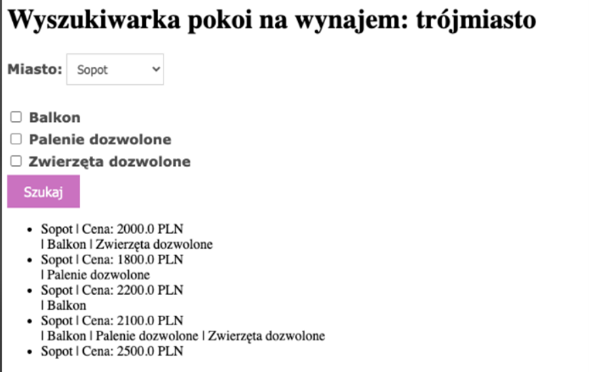
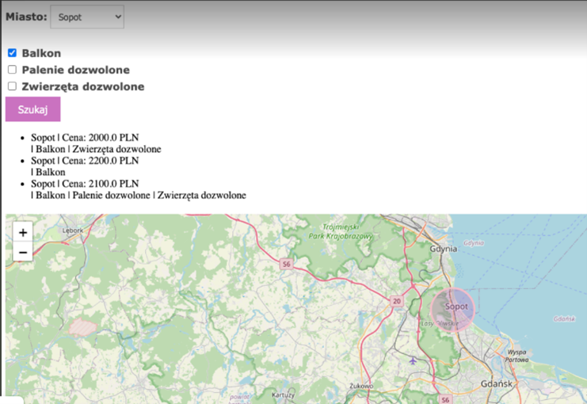
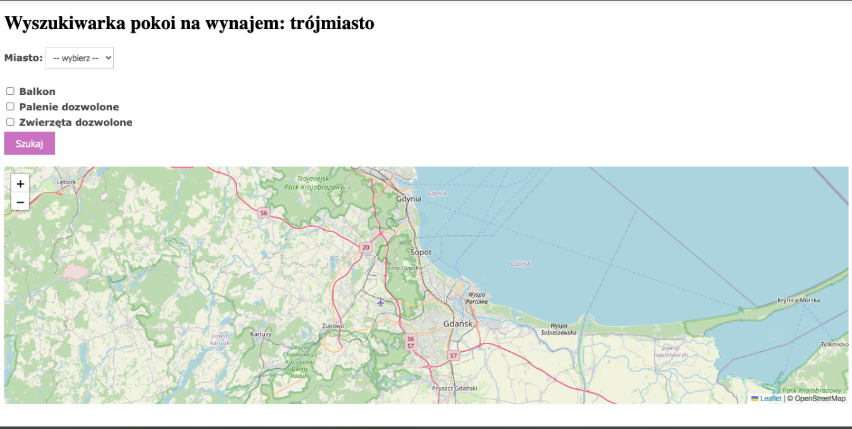
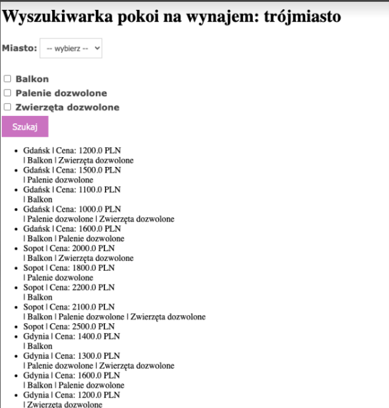

# 🏡 Roommate Finder – Dokumentacja Projektu

## 1. Charakterystyka oprogramowania

### a. Nazwa skrócona
**Roommate Finder**

### b. Nazwa pełna
**Roommate Finder – Aplikacja do przeglądania ofert pokojów na wynajem**

### c. Opis i cele projektu
Roommate Finder to lekka aplikacja internetowa, która umożliwia użytkownikom przeglądanie ofert pokojów na wynajem w Trójmieście (Gdańsk, Sopot, Gdynia). Projekt skupia się na prostocie i użyteczności — użytkownik wybiera lokalizację i preferencje, a aplikacja prezentuje odpowiednie ogłoszenia.

**Główne cele aplikacji:**
- Ułatwienie przeglądania ofert pokojów z podziałem na miasta Trójmiasta
- Proste filtrowanie według podstawowych kryteriów (np. balkon, palenie, zwierzęta)
- Interaktywna mapa wskazująca wybraną lokalizację w skali ogólnej (bez dokładnych adresów)

---

## 2. Prawa autorskie

### a. Autorzy
- Maja Wielgus  
- Paulina Pacuła  
- Wiktoria Radzanowska

### b. Warunki licencyjne
Projekt objęty jest licencją **MIT**.

**Zewnętrzne komponenty:**
- Leaflet.js – open-source biblioteka mapowa (licencja **BSD 2-Clause License**)
- Dane mapowe pochodzą z **OpenStreetMap** (licencja **ODbL**)

Pełne treści licencji znajdują się w pliku LICENSE.

---

### 3. Scenariusze testowe

Poniższa tabela przedstawia główne scenariusze testowe oparte na **user stories**, zidentyfikowane na podstawie wymagań funkcjonalnych aplikacji. Szczegółowe przypadki testowe wraz ze screenami znajdują się w punkcie [6. Przypadki testowe](#6-przypadki-testowe).

| Nr | Nazwa testu              | Opis                                                             | Odniesienie                      |
|----|---------------------------|------------------------------------------------------------------|----------------------------------|
| 1  | Wybór lokalizacji         | Użytkownik wybiera miasto, aby zobaczyć dostępne pokoje         | [5.1](#1-wybór-lokalizacji)      |
| 2  | Filtrowanie ofert         | Użytkownik filtruje pokoje według preferencji                   | [5.2](#2-filtrowanie-ofert)      |
| 3  | Wyświetlanie wyników      | Użytkownik przegląda oferty wraz z opisem i ceną                | [5.3](#3-wyświetlenie-wyników)   |
| 4  | Mapa z miastem            | Użytkownik widzi mapę z lokalizacją wybranego miasta            | [5.4](#4-mapa-z-miastem)         |
| 5  | Domyślna mapa Trójmiasta  | Aplikacja pokazuje ogólną mapę Trójmiasta po załadowaniu strony | [5.5](#5-domyślna-mapa-trójmiasta) |
| 6  | Brak lokalizacji          | Bez wyboru lokalizacji użytkownik widzi wszystkie oferty        | [5.6](#6-brak-wybranej-lokalizacji) |

> ℹ️ **Notatka**: Scenariusze testowe oparto na uproszczonych _user stories_, które odzwierciedlają podstawowe potrzeby użytkowników końcowych.

---

## 4. Architektura systemu

### a. Architektura rozwojowa

| Technologia | Przeznaczenie            | Wersja     |
|-------------|--------------------------|------------|
| Python      | Backend                  | >= 3.10    |
| Flask       | Framework webowy         | 2.x        |
| SQLite      | Baza danych              | dowolna    |
| Jinja2      | Szablony HTML            | wbudowany  |
| JavaScript  | Interaktywne mapy        | dowolna    |
| Leaflet.js  | Biblioteka mapowa        | -          |
| CSS         | Stylowanie               | -          |

### b. Architektura uruchomieniowa

| Technologia           | Przeznaczenie             | Wersja     |
|-----------------------|---------------------------|------------|
| Python                | Środowisko uruchomieniowe | >= 3.10    |
| Flask                 | Serwer aplikacji          | 2.x        |
| SQLite                | Baza danych               | dowolna    |
| Przeglądarka WWW      | Interfejs użytkownika     | aktualna   |

---

## 5. Testy

### a. Przypadki testowe

### 1. Wybór lokalizacji
- **Cel:** Filtracja pokoi według miasta.

- **Kroki:**
1. Wybierz miasto z listy.  
2. Kliknij „Szukaj”.  
- **Oczekiwany wynik:**  
Lista zawiera tylko pokoje z wybranego miasta.

### 2. Filtrowanie ofert
- **Cel:** Ograniczenie wyników wyszukiwania zgodnie z zaznaczonymi filtrami. 

- **Kroki:**  
1. Zaznacz wybrane preferencje (np. balkon, palenie, zwierzęta).  
2. Kliknij „Szukaj”.  

- **Oczekiwany wynik:**  
Lista zawiera tylko pokoje spełniające wybrane preferencje.

- 

### 3. Wyświetlenie wyników
- **Cel:** Prezentacja wszystkich kluczowych informacji o pokojach.

- **Kroki:**  
1. Wyszukaj pokoje (dowolne kryteria).  
2. Przejrzyj wyświetloną listę ofert.  
- **Oczekiwany wynik:**  
Każda oferta zawiera opis, cenę i podstawowe cechy pokoju.

### 4. Mapa z miastem
- **Cel:** Wizualizacja wybranego miasta na mapie.  

- **Kroki:**  
1. Wybierz miasto z listy.  
2. Kliknij „Szukaj”.  
3. Sprawdź mapę.  
- **Oczekiwany wynik:**  
Mapa centruje się na wybranym mieście i wyświetla jego obszar.

### 5. Domyślna mapa Trójmiasta
- **Cel:** Prezentacja domyślnego widoku mapy dla całego obszaru Trójmiasta.  

- **Kroki:**  
1. Otwórz stronę główną aplikacji.  
- **Oczekiwany wynik:**  
Wyświetla się mapa obejmująca cały obszar Trójmiasta.

### 6. Brak wybranej lokalizacji
- **Cel:** Wyświetlenie wszystkich ofert przy braku wybranego miasta.  

- **Kroki:**  
1. Nie wybieraj miasta z listy.  
2. Kliknij „Szukaj”.  
- **Oczekiwany wynik:**  
Lista zawiera wszystkie dostępne pokoje z bazy danych.

### b. Sprawozdanie z wykonywanych testów

**Podsumowanie:**  
Testy manualne zostały przeprowadzone na działającej wersji aplikacji Roommate Finder w środowisku deweloperskim

**Zakres testów:**  
Przetestowano wszystkie kluczowe funkcjonalności opisane w przypadkach testowych: wybór lokalizacji, filtrowanie ofert, wyświetlanie wyników, mapa z miastem, domyślna mapa Trójmiasta, brak wybranej lokalizacji.

**Wyniki testów:**

| **ID** | **Nazwa testu**             | **Status**       | **Opis wykonania**                                                                 | **Błędy / Uwagi**                                  |
|--------|------------------------------|------------------|-------------------------------------------------------------------------------------|----------------------------------------------------|
| T1     | Test wyboru lokalizacji      | ✅ ZALICZONY      | Lista rozwijana z miastami działa poprawnie. Wyniki wyświetlają się zgodnie z wyborem. | Brak uwag.                                         |
| T2     | Test filtrowania ofert       | ✅ ZALICZONY      | Checkboxy działają prawidłowo. Wyniki są filtrowane zgodnie z zaznaczonymi preferencjami. | Brak uwag.                                         |
| T3     | Test wyświetlania wyników    | ✅ ZALICZONY      | Lista ofert jest czytelna, zawiera nazwę, cenę i krótki opis pokoju.                 | Można rozważyć dodanie zdjęć do oferty.            |
| T4     | Test mapy miasta             | ✅ ZALICZONY      | Po wyborze lokalizacji mapa przesuwa się i centruje na wybranym mieście.             | Brak uwag.                                         |
| T5     | Test domyślnej mapy          | ✅ ZALICZONY      | Po wejściu na stronę mapa pokazuje domyślnie całe Trójmiasto.                        | Brak uwag.                                         |
| T6     | Test bez wyboru lokalizacji  | ✅ ZALICZONY      | Bez wyboru lokalizacji wyświetlane są wszystkie oferty z bazy.                      | Brak uwag. 	

**Podsumowanie wyników:**  
- Łącznie przetestowano 6 przypadków testowych.
- Wszystkie przypadki zakończyły się wynikiem pozytywnym.
- Nie wykryto błędów ani defektów podczas testów manualnych.

**Brak testów automatycznych.**

---

## 7. Dodatki

- Plik `requirements.txt` zawiera wszystkie zależności.
- Kod aplikacji znajduje się w folderze `roommate-finder/`
- Mapa realizowana jest z wykorzystaniem Leaflet.js (open-source, BSD 2-Clause License)
