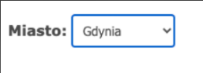

# 🏡 Roommate Finder – Dokumentacja Projektu

## 1. Charakterystyka oprogramowania

### a. Nazwa skrócona
**Roommate Finder**

### b. Nazwa pełna
**Roommate Finder – Aplikacja do przeglądania ofert pokojów na wynajem**

### c. Opis i cele projektu
Roommate Finder to lekka aplikacja internetowa, która umożliwia użytkownikom przeglądanie ofert pokojów na wynajem w Trójmieście (Gdańsk, Sopot, Gdynia). Projekt skupia się na prostocie i użyteczności — użytkownik wybiera lokalizację i preferencje, a aplikacja prezentuje odpowiednie ogłoszenia.

**Główne cele aplikacji:**
- Ułatwienie przeglądania ofert pokojów z podziałem na miasta Trójmiasta
- Proste filtrowanie według podstawowych kryteriów (np. balkon, palenie, zwierzęta)
- Interaktywna mapa wskazująca wybraną lokalizację w skali ogólnej (bez dokładnych adresów)

---

## 2. Prawa autorskie

### a. Autorzy
- Maja Wielgus  
- Paulina Pacuła  
- Wiktoria Radzanowska

### b. Warunki licencyjne
Projekt objęty jest licencją **MIT**.

**Zewnętrzne komponenty:**
- [Leaflet.js](https://leafletjs.com) – open-source biblioteka mapowa (licencja BSD 2-Clause License)

Pełne treści licencji znajdują się w pliku LICENSE.

---

### 3. Scenariusze testowe

Poniższa tabela przedstawia główne scenariusze testowe oparte na **user stories**, zidentyfikowane na podstawie wymagań funkcjonalnych aplikacji. Szczegółowe przypadki testowe wraz ze screenami znajdują się w punkcie [6. Przypadki testowe](#6-przypadki-testowe).

| Nr | Nazwa testu              | Opis                                                             | Odniesienie                      |
|----|---------------------------|------------------------------------------------------------------|----------------------------------|
| 1  | Wybór lokalizacji         | Użytkownik wybiera miasto, aby zobaczyć dostępne pokoje         | [6.1](#1-wybór-lokalizacji)      |
| 2  | Filtrowanie ofert         | Użytkownik filtruje pokoje według preferencji                   | [6.2](#2-filtrowanie-ofert)      |
| 3  | Wyświetlanie wyników      | Użytkownik przegląda oferty wraz z opisem i ceną                | [6.3](#3-wyświetlenie-wyników)   |
| 4  | Mapa z miastem            | Użytkownik widzi mapę z lokalizacją wybranego miasta            | [6.4](#4-mapa-z-miastem)         |
| 5  | Domyślna mapa Trójmiasta  | Aplikacja pokazuje ogólną mapę Trójmiasta po załadowaniu strony | [6.5](#5-domyślna-mapa-trójmiasta) |
| 6  | Brak lokalizacji          | Bez wyboru lokalizacji użytkownik widzi wszystkie oferty        | [6.6](#6-brak-wybranej-lokalizacji) |

> ℹ️ **Notatka**: Scenariusze testowe oparto na uproszczonych _user stories_, które odzwierciedlają podstawowe potrzeby użytkowników końcowych.

---

## 4. Architektura systemu

### a. Architektura rozwojowa

| Technologia | Przeznaczenie            | Wersja     |
|-------------|--------------------------|------------|
| Python      | Backend                  | >= 3.10    |
| Flask       | Framework webowy         | 2.x        |
| SQLite      | Baza danych              | dowolna    |
| Jinja2      | Szablony HTML            | wbudowany  |
| JavaScript  | Interaktywne mapy        | dowolna    |
| Leaflet.js  | Biblioteka mapowa        | -          |
| CSS         | Stylowanie               | -          |

### b. Architektura uruchomieniowa

| Technologia           | Przeznaczenie             | Wersja     |
|-----------------------|---------------------------|------------|
| Python                | Środowisko uruchomieniowe | >= 3.10    |
| Flask                 | Serwer aplikacji          | 2.x        |
| SQLite                | Baza danych               | dowolna    |
| Przeglądarka WWW      | Interfejs użytkownika     | aktualna   |

---

## 5. Testy

### a. Sprawozdanie z testów
- Przeprowadzono testy manualne na etapie rozwoju aplikacji.
- Brak testów automatycznych.

---

## 6. Przypadki testowe

### 1. Wybór lokalizacji
- **Cel:** Zobaczyć dostępne pokoje w wybranym mieście.
- **Komentarz:** Lista rozwijana z Gdańsk/Sopot/Gdynia działa poprawnie.

### 2. Filtrowanie ofert
- **Cel:** Znaleźć pokoje z wybranymi preferencjami (balkon, palenie, zwierzęta).
- **Komentarz:** Checkboxy działają poprawnie.
- 

### 3. Wyświetlenie wyników
- **Cel:** Zobaczyć listę pokoi z opisem i ceną.
- **Komentarz:** Lista działa poprawnie, pokazuje podstawowe dane.

### 4. Mapa z miastem
- **Cel:** Zobaczyć mapę z ogólną lokalizacją wybranego miasta.
- **Komentarz:** Mapa centruje się poprawnie.

### 5. Domyślna mapa Trójmiasta
- **Cel:** Po wejściu na stronę zobaczyć domyślny widok całego Trójmiasta.
- **Komentarz:** Działa poprawnie.

### 6. Brak wybranej lokalizacji
- **Cel:** Zobaczyć wszystkie pokoje w bazie.
- **Komentarz:** Wszystkie oferty się wyświetlają.

---

## 7. Dodatki

- Plik `requirements.txt` zawiera wszystkie zależności.
- Kod aplikacji znajduje się w folderze `roommate-finder/`
- Mapa realizowana jest z wykorzystaniem Leaflet.js (open-source, BSD 2-Clause License)
